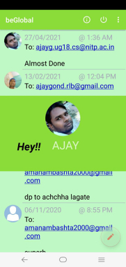

# `beGlobal`
## `beGlobal | APP WHICH CONNECTS ALL`
### Table of Contents
*[General info](#General-info)<br>
*[Screenshots](#Screenshots)<br>
*[Technologies](#Technologies)<br>
*[Installation](#Install)

#### General info
```
A blog based android application where anyone can share their thoughts created using JAVA and FIREBASE.
```
#### Screenshots





#### Technologies
```
* JAVA
* FIREBASE

```
#### Installation
* <a href="./app/install/beGlobal.apk">Link for downloading beGlobal.apk file.Click on 'View raw' to download the beGlobal.apk file.</a>


